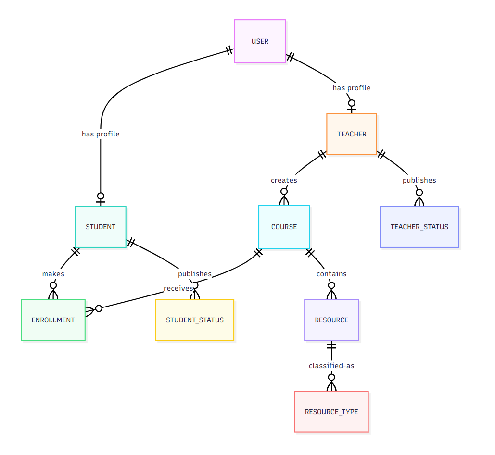
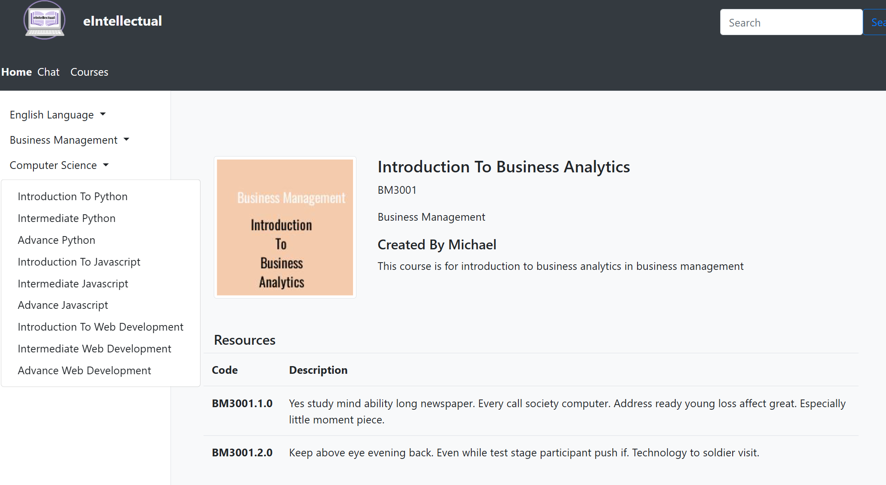
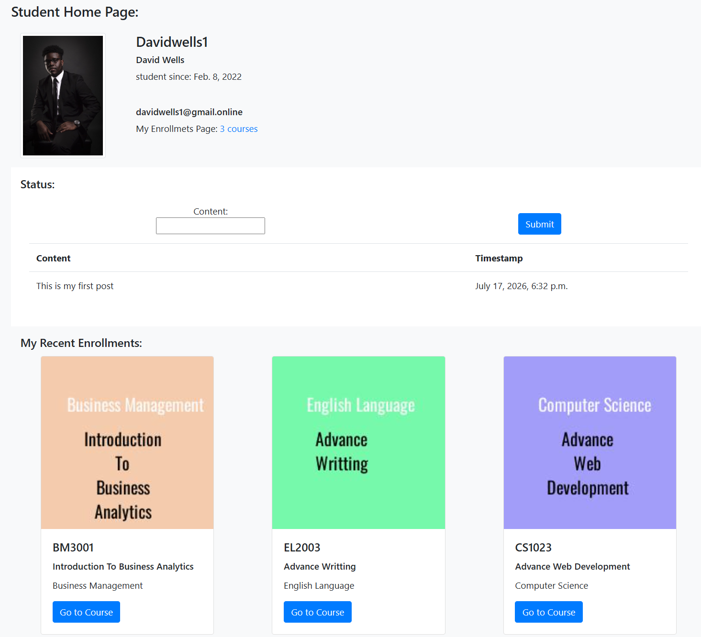
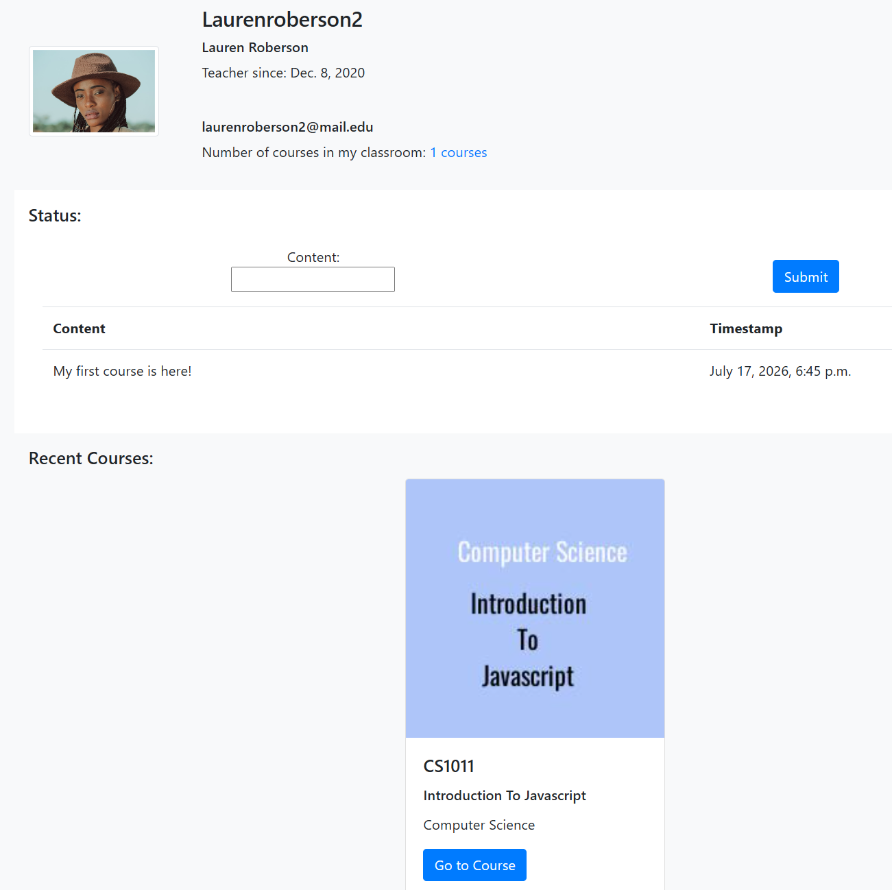
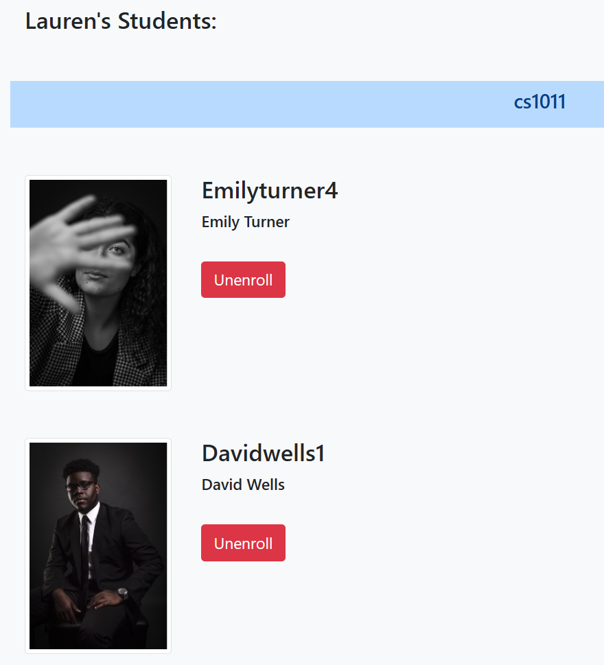
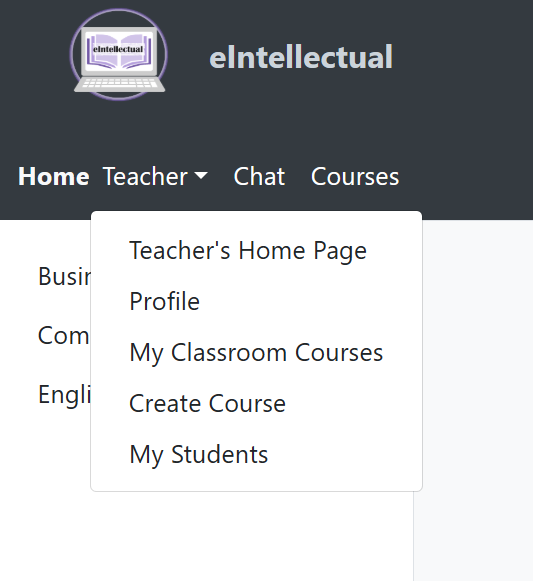
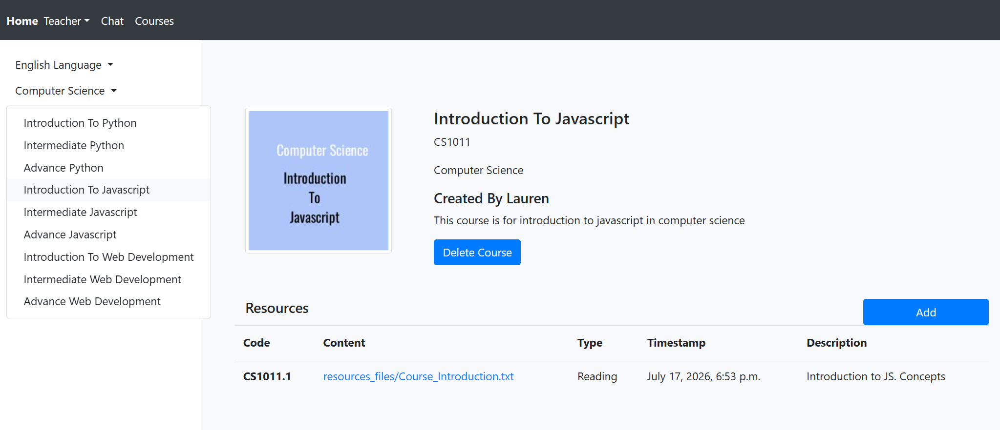
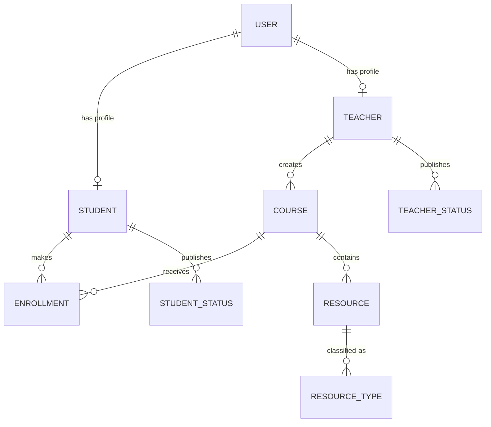

# Role-Based Learning Management System (LMS)
## eIntellectual — Role-Based eLearning Platform


A modular learning management system built with Django. The application supports separate student and teacher workflows, course and resource management, enrollment, user profiles, seeded demonstration data, and an experimental WebSocket chat module.

> **Project status:** Academic software-engineering project. The primary learning-management workflows are implemented and runnable locally. The chat module was started as an experimental feature but was not completed.

<p align="center">
  
</p>

---

## Project Overview

The project explores how a role-based web application can organize learning content and interactions for two distinct user groups. Teachers can manage courses and supporting resources, while students can browse available courses, enroll, and access course content through personalized views.

The application was designed as a collection of focused Django apps rather than a single monolithic module. This separation keeps authentication, student workflows, teacher workflows, course management, and chat functionality easier to maintain and test.

---

## Key Features

### Students

- Register and authenticate using a student account
- View a personalized student profile and dashboard
- Browse the course catalog
- Enroll in available courses
- Access course details and uploaded learning resources
- Publish a short profile status

### Teachers

- Register and authenticate using a teacher account
- View a personalized teacher profile and dashboard
- Create and manage courses
- Upload course resources and supporting files
- View course and enrollment information
- Publish a short profile status

### Platform and Data

- Custom Django user model with student and teacher roles
- Relational models for users, courses, resources, resource types, and enrollments
- SQLite database for local development
- Seeded demonstration data loaded from CSV files
- Django forms, views, templates, and role-based access controls
- Unit tests for selected models, forms, and views

### Experimental Chat Module

The repository contains an early Django Channels/WebSocket chat prototype. This portion was not completed within the original project timeframe and should be treated as exploratory work rather than a production-ready feature.

---

## Application Preview

<!-- Replace the paths below with the exact filenames from your project_images directory. -->

### Course Discovery

<p align="center">
  
</p>

The course catalog is the strongest overview image because it quickly communicates the purpose of the application and shows the content structure.

### Student Experience

<p align="center">
  
</p>

The student area demonstrates the personalized, role-based workflow and how learners access their courses and resources.

### Teacher Experience

<p align="center">
  
  
  
</p>
  
The teacher area highlights the administrative side of the platform, including course creation and resource management.

### Course and Resource Management

<p align="center">
  
</p>


This view shows the relationship between courses and uploaded learning materials and is useful for explaining the underlying data model.

---

## Architecture

The application uses Django's model-template-view architecture and is divided into the following apps:

```text
management/   Custom user model, authentication, and shared account workflows
students/     Student registration, profile, dashboard, and status features
teachers/     Teacher registration, profile, dashboard, and status features
courses/      Courses, resources, resource types, and enrollments
chat/         Experimental WebSocket chat prototype
scripts/      Demonstration-data loading utilities
models_factories/  Helpers used to create seeded model data
```

### Core Data Relationships



---

## Technology Stack

- **Backend:** Python, Django
- **Frontend:** Django templates, HTML, CSS, Bootstrap 4
- **Database:** SQLite
- **Media handling:** Pillow and Django file/image fields
- **Development utilities:** django-extensions
- **Experimental asynchronous layer:** Django Channels and Daphne
- **Testing:** Django test framework

---

## Repository Structure

```text
django-elearning-platform/
├── eLearningApp/
│   ├── eIntellectual/
│   │   ├── chat/
│   │   ├── courses/
│   │   ├── eIntellectual/
│   │   ├── management/
│   │   ├── models_factories/
│   │   ├── scripts/
│   │   ├── students/
│   │   ├── teachers/
│   │   ├── templates/
│   │   ├── tests/
│   │   └── manage.py
│   └── seeding_files/
|   └── requirements.txt
├── data/
├── project_images/
├── Academic_Report.pdf
└── README.md
```

---

## Local Installation

### 1. Clone the repository

```bash
git clone https://github.com/mayramtv/django-elearning-platform.git
cd django-elearning-platform/eLearningApp
```

### 2. Create and activate a virtual environment

On Windows:

```bash
python -m venv .venv
.venv\Scripts\activate
```

On macOS or Linux:

```bash
python3 -m venv .venv
source .venv/bin/activate
```

### 3. Install dependencies

```bash
python -m pip install --upgrade pip
pip install -r requirements.txt
```

### 4. Move to the Django project directory

```bash
cd eIntellectual
```

### 5. Apply database migrations

```bash
python manage.py migrate
```

### 6. Load demonstration data

```bash
python manage.py runscript load_data
```

Run this command only when the database has not already been populated. The repository may also include a local SQLite database containing demonstration records.

### 7. Start the development server

```bash
python manage.py runserver 127.0.0.1:8080
```

Open `http://127.0.0.1:8080/` in a browser.

---

## Running Tests

From the directory containing `manage.py`:

```bash
python manage.py test
```

The test suite includes selected checks for:

- Course, resource, enrollment, student, and teacher models
- Student, teacher, course, resource, and enrollment forms
- Selected student and course views

---

## Engineering Decisions

### Modular Django apps

Student, teacher, course, management, and chat concerns were separated into individual apps. This makes each domain easier to understand and reduces coupling between unrelated features.

### Custom user roles

A custom user model extends Django's `AbstractUser` with student and teacher role flags. Each authenticated user is connected to the corresponding profile through a one-to-one relationship.

### Relational course model

Courses connect teachers, students, resources, and enrollments through explicit foreign-key relationships. The structure supports one teacher managing multiple courses and students enrolling in multiple courses.

### Seeded demonstration data

CSV files and a custom Django script populate sample students, teachers, courses, resources, and enrollments. This makes the main workflows easier to review without manually creating every record.

---

## Limitations

- The application is configured for local development rather than production deployment.
- SQLite is appropriate for demonstration purposes but would need to be replaced for a larger multi-user deployment.
- Secrets and environment-specific settings should be moved to environment variables before deployment.
- The user interface reflects the project's academic scope and was not designed as a production design system.
- Chat is incomplete and lacks a finalized channel-layer configuration, comprehensive tests, and production-ready message handling.
- Automated test coverage is selective rather than comprehensive.

---

## Future Improvements

- Complete and test the WebSocket chat workflow
- Add a configured Redis channel layer for real-time communication
- Strengthen object-level authorization and security testing
- Add pagination, filtering, and search to the course catalog
- Improve responsive and accessible interface behavior
- Move configuration secrets into environment variables
- Add continuous integration for automated tests
- Prepare PostgreSQL and production deployment settings

---

## What I Learned

This project strengthened my understanding of full-stack Django development, modular application design, custom authentication, relational database modeling, file handling, seeded data workflows, and automated testing. It also showed the importance of defining a realistic feature scope: the main learning-management workflows were completed, while the experimental chat feature documented the limits of the original development timeframe.

---

## Supporting Documentation

A detailed academic report is included in the repository as `Academic_Report.pdf`. It contains the original requirements, database design, implementation discussion, testing evidence, and project evaluation.

---

## Acknowledgements

The project was developed for the University of London Advanced Web Development module. Selected implementation patterns were informed by course lectures, laboratories, the Django documentation, and sources acknowledged in the code and academic report.

---

## License

This repository is presented for educational and portfolio purposes. This project is available under the MIT License.
